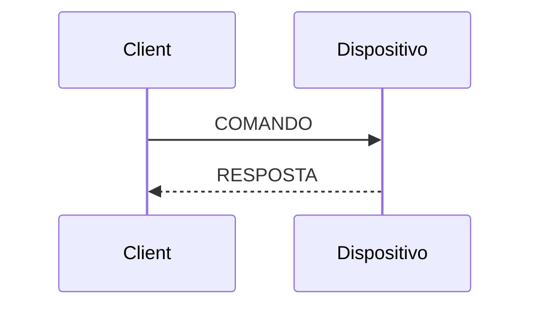
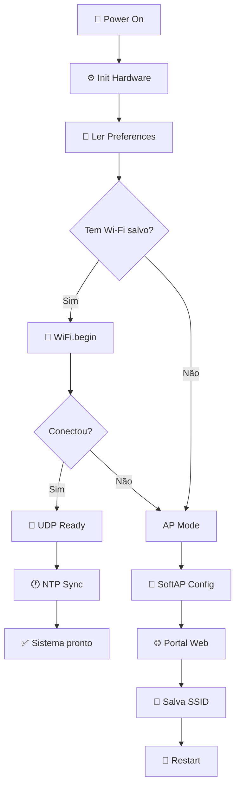

# 🎯 M5NanoC6 WiFi

<div align="center">

[](https://www.espressif.com/en/products/socs/esp32)
[](https://docs.m5stack.com/en/core/nanoC6)
[](https://www.wifi-alliance.com/)
[](https://en.wikipedia.org/wiki/User_Datagram_Protocol)
[](https://en.cppreference.com/)
[](LICENSE)

**🚀 Firmware modular e eficiente para provisionamento Wi‑Fi, controle remoto UDP e monitoramento do M5NanoC6**

[⭐ Features](#-recursos-principais) • [🚀 Quick Start](#-início-rápido) • [📡 API](#-protocolo-udp) • [🛠️ Hardware](#hardware-e-pinagem) • [📖 Docs](#-documentação)

</div>

---

## 📋 Visão geral

Este é um **firmware production-ready** para o M5NanoC6 que oferece:

- ✅ Provisionamento Wi‑Fi com portal web local
- ✅ Armazenamento persistente de credenciais em `Preferences`
- ✅ Reconexão automática e reset de fábrica
- ✅ Controle remoto via **UDP na porta 4210**
- ✅ Diagnósticos de rede, CPU, RAM, flash e uptime
- ✅ Sincronização **NTP** com suporte a timezone e DST
- ✅ LED RGB para feedback visual do sistema
- ✅ **OTA** (Over-The-Air) para atualizar sem cabo
- ✅ Emissão de pulso infravermelho via GPIO

Desenvolvido em **C++17** com arquitetura modular para facilitar manutenção e extensão.

---

## ✨ Recursos principais

<table>
<tr>
<td width="50%">

### 🔐 Provisionamento seguro
- Portal web captivo em modo AP
- SSID/senha salvos em flash
- Reconexão automática
- Reset de fábrica via botão

</td>
<td width="50%">

### 📡 Controle remoto
- Gateway UDP **4210**
- Comandos textuais simples
- Respostas estruturadas
- Sem latência crítica

</td>
</tr>
<tr>
<td width="50%">

### 🎨 Hardware integrado
- LED RGB para status
- Botão de reset
- IR emitter (GPIO 3)
- LED azul de status

</td>
<td width="50%">

### 📊 Monitoramento
- CPU, RAM, flash
- Uptime e reset reason
- Sinal Wi‑Fi (RSSI)
- NTP sincronizado

</td>
</tr>
</table>

---

## 🚀 Início rápido

### Pré-requisitos

```bash
✓ Arduino IDE ou PlatformIO
✓ Placa M5NanoC6 (ESP32)
✓ Cabo USB para gravação
✓ Bibliotecas: WiFi, WebServer, Preferences, Adafruit NeoPixel
```

### 1️⃣ Clone e prepare

```bash
git clone https://github.com/paulocfmarques-collab/M5NanoC6_wifi.git
cd M5NanoC6_wifi
```

### 2️⃣ Configure e faça upload

No Arduino IDE:
1. Abra `M5NanoC6_wifi.ino`
2. Selecione **Placa: M5Stack M5NanoC6** (ou ESP32)
3. Escolha a **porta serial**
4. Clique em **Upload**

### 3️⃣ Configure a rede

Na primeira inicialização sem Wi‑Fi salvo:

1. **Conecte** ao AP: `M5NanoC6_CONFIG`
2. Abra no navegador: `http://192.168.4.1`
3. Informe **SSID** e **senha**
4. Clique **Salvar** → dispositivo reinicia

> Serial: `115200 baud` exibe os logs de inicialização

---

## 🏗️ Arquitetura do projeto

```
M5NanoC6_wifi/
├── 📄 M5NanoC6_wifi.ino ......... Entrada principal e loop
├── ⚙️  Config.h ................ Pinos, UDP, HTML do portal
├── 🎨 HardwareController.h ...... RGB LED, botão, IR
├── 📡 DeviceNetwork.h ........... Wi‑Fi, AP, UDP, OTA
├── 🕐 NTPService.h ............ NTP e timezone
├── 💬 CommandHandler.h ......... Parser de comandos UDP
├── 📖 README.md ............... Documentação
└── 📝 CHANGELOG.md ............ Histórico de versões
```

### Módulos principais

| Arquivo | Responsabilidade |
| :--- | :--- |
| **M5NanoC6_wifi.ino** | Boot, loop, fluxo de execução |
| **Config.h** | Pinos, porta UDP, fuso, HTML |
| **HardwareController.h** | LED RGB, blink, botão, IR |
| **DeviceNetwork.h** | Wi‑Fi STA/AP, UDP, OTA, web server |
| **NTPService.h** | Sincronização de hora e timezone |
| **CommandHandler.h** | Interpretação de comandos |

---

## 📡 Protocolo UDP

**Porta:** `4210`  
**Formato:** Texto simples  
**Resposta:** UDP de volta ao cliente  

### Fluxo de comunicação


---

## 🎮 Tabela de comandos

### Diagnósticos e monitoramento

| Comando | Descrição | Exemplo |
| :--- | :--- | :--- |
| `help` | Lista todos os comandos | `help` |
| `info` | Status completo do dispositivo | `info` |
| `status` | Resumo rápido | `status` |
| `cpu` | Modelo, cores, frequência | `cpu` |
| `ram` | Heap, memória livre | `ram` |
| `flash` | Tamanho, velocidade | `flash` |
| `temp` | Temperatura da CPU | `temp` |
| `mac` | Endereço MAC | `mac` |
| `net_info` | SSID, IP, gateway, RSSI | `net_info` |
| `time` | Hora atual (NTP) | `time` |
| `date` | Data atual (NTP) | `date` |
| `uptime` | Tempo de atividade | `uptime` |
| `reason` | Motivo do último reset | `reason` |
| `version` | Versão do firmware | `version` |
| `build` | Data/hora de compilação | `build` |
| `alive` | Verificação de presença | `alive` |
| `psram` | Estado de PSRAM | `psram` |
| `ota_info` | Info do servidor OTA | `ota_info` |

### Configuração e hardware

| Comando | Descrição | Exemplo |
| :--- | :--- | :--- |
| `reset_wifi` | Limpa Wi‑Fi e reinicia | `reset_wifi` |
| `set_fuso` | Define timezone | `set_fuso:-3` |
| `fuso_status` | Mostra fuso atual | `fuso_status` |
| `dst_on` | Ativa horário de verão | `dst_on` |
| `dst_off` | Desativa horário de verão | `dst_off` |
| `dst_status` | Verifica status de DST | `dst_status` |
| `led_on` | Liga LED em branco | `led_on` |
| `led_off` | Desliga LED | `led_off` |
| `set_rgb` | Define cor do LED | `set_rgb:255,0,0` |
| `ir_tx` | Dispara pulso IR | `ir_tx` |

### Exemplo de uso

```bash
# Verificar status
nc -u 192.168.1.100 4210 <<< "status"

# Consultar hora
nc -u 192.168.1.100 4210 <<< "time"

# Ligar LED em vermelho
nc -u 192.168.1.100 4210 <<< "set_rgb:255,0,0"

# Mudar timezone
nc -u 192.168.1.100 4210 <<< "set_fuso:-5"
```

---

## 🛠️ Hardware e pinagem

| Sinal | GPIO | Função |
| :--- | :---: | :--- |
| LED RGB (data) | 20 | Dados do NeoPixel |
| LED RGB (enable) | 19 | Habilita barramento |
| LED Status (azul) | 7 | Indicador visual |
| Botão usuário | 9 | Reset Wi‑Fi |
| IR TX | 3 | Emissor infravermelho |

**Configuração validada para:** M5NanoC6 com ESP32-C6

---

## 🔄 Fluxo de boot



---

## 🎨 Estados visuais do LED

O LED RGB indica o estado do sistema:

| Cor | Estado |
| :--- | :--- |
| 🟢 Verde | Wi‑Fi conectado, UDP pronto |
| 🔵 Azul | Portal de configuração ativo |
| 🟡 Amarelo | Tentativa de conexão Wi‑Fi |
| 🔴 Vermelho | Falha de conexão / erro |
| 🟣 Magenta | NTP sincronizado |
| ⚪ Branco | Inicialização |

---

## 🌐 Portal web

### Tela de configuração (AP Mode)

Quando sem Wi‑Fi salvo, acesse:

```
http://192.168.4.1
```

**Campos:**
- SSID da rede
- Senha Wi‑Fi

**Ação:** Salva em Preferences e reinicia automaticamente

### Painel de informações (STA Mode)

Quando conectado, acesse o painel para visualizar:

- Chip e cores
- RAM livre
- Uptime
- SSID conectado + RSSI
- Data e hora sincronizadas

---

## ⏰ Sincronização NTP

O sistema sincroniza automaticamente com:

- `a.st1.ntp.br`
- `pool.ntp.org`
- `time.nist.gov`

**Fuso padrão:** `GMT-3` (Brasília)

Altere com: `set_fuso:-5`  
Ative DST com: `dst_on`

---

## 🔧 Troubleshooting

### Wi‑Fi não conecta
- ✓ Verifique SSID e senha
- ✓ Use `reset_wifi` para limpar
- ✓ Confirme alcance do roteador

### AP não aparece
- ✓ Reinicie o dispositivo
- ✓ Verifique serial em 115200 baud
- ✓ Confirme GPIO 19 e 20 funcionando

### UDP sem resposta
- ✓ Confirme IP do dispositivo com `net_info`
- ✓ Verifique porta 4210 liberada
- ✓ Teste com `ping` ou `alive`

### NTP não sincroniza
- ✓ Confirme acesso à internet
- ✓ Ajuste timezone com `set_fuso`
- ✓ Verifique DNS e firewall

---

## 📊 Performance

| Métrica | Valor |
| :--- | :--- |
| **Boot time** | < 3s (com Wi‑Fi) |
| **UDP latency** | < 50ms |
| **RAM utilizada** | ~60KB |
| **Flash utilizada** | ~350KB |
| **Wi‑Fi reconnect** | < 8s |

---

## 🔐 Notas de segurança

⚠️ **Este projeto é para redes locais confiáveis:**

- UDP **não é criptografado**
- Portal web **sem autenticação** padrão
- Não exponha na internet pública
- Proteja com firewall e VPN se necessário

---

## 📚 Recursos e links

| Recurso | Link |
| :--- | :--- |
| **M5Stack Docs** | https://docs.m5stack.com/en/core/nanoC6 |
| **ESP32 Specs** | https://www.espressif.com/en/products/socs/esp32 |
| **Arduino IDE** | https://www.arduino.cc/en/software |
| **PlatformIO** | https://platformio.org/ |

---

## 🤝 Contribuição

Tem uma ideia? Achou um bug? Quer melhorar?

1. **Fork** o repositório
2. Crie uma **branch** com sua feature
3. **Commit** suas mudanças
4. Abra um **Pull Request**

```bash
git checkout -b feature/sua-ideia
git commit -m "Adiciona sua feature"
git push origin feature/sua-ideia
```

---

## 📄 Licença

Este repositório ainda não possui licença explícita. Para publicar oficialmente, considere adicionar **MIT**, **Apache 2.0** ou **GPL**.

---

## 📞 Suporte e feedback

- 🐛 **Issues:** https://github.com/paulocfmarques-collab/M5NanoC6_wifi/issues
- 📬 **Pull Requests:** https://github.com/paulocfmarques-collab/M5NanoC6_wifi/pulls
- 💬 **Discussões:** https://github.com/paulocfmarques-collab/M5NanoC6_wifi/discussions

---

<div align="center">

### ⭐ Se este projeto ajudou você, considere dar uma estrela!

**Feito com ❤️ para a comunidade ESP32 e IoT**


</div>
