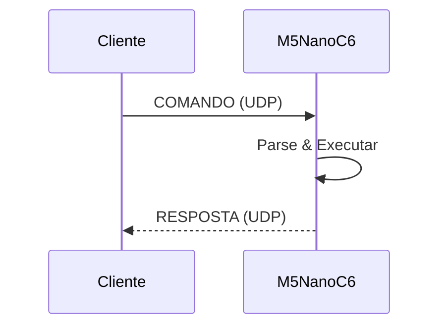
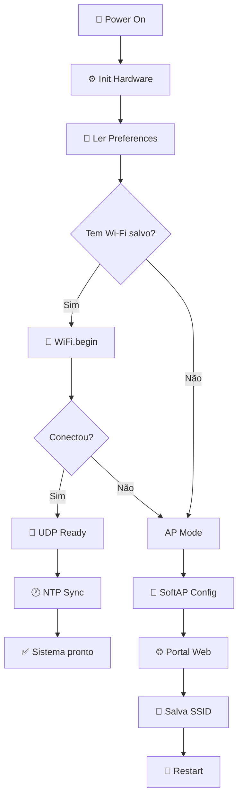

# 🎯 M5NanoC6 WiFi

<div align="center">

[](https://www.espressif.com/en/products/socs/esp32)
[](https://docs.m5stack.com/en/core/nanoC6)
[](https://www.wifi-alliance.com/)
[](https://en.wikipedia.org/wiki/User_Datagram_Protocol)
[](https://en.cppreference.com/)
[](LICENSE)

**🚀 Firmware modular e eficiente para provisionamento Wi‑Fi, controle remoto UDP e monitoramento do M5NanoC6**

[⭐ Features](#-recursos-principais) • [🚀 Quick Start](#-início-rápido) • [📡 API](#-protocolo-udp) • [🛠️ Hardware](#-hardware-e-pinagem) • [📖 Docs](#-documentação)

</div>

---

## 📋 Visão geral

Este é um **firmware production-ready** para o M5NanoC6 que oferece:

- ✅ Provisionamento Wi‑Fi com portal web local
- ✅ Armazenamento persistente de credenciais em `Preferences`
- ✅ Reconexão automática e reset de fábrica
- ✅ Controle remoto via **UDP na porta 4210**
- ✅ Diagnósticos de rede, CPU, RAM, flash e uptime
- ✅ Sincronização **NTP** com suporte a timezone e DST
- ✅ LED RGB para feedback visual do sistema
- ✅ **OTA** (Over-The-Air) para atualizar sem cabo
- ✅ Emissão de pulso infravermelho via GPIO

Desenvolvido em **C++17** com arquitetura modular para facilitar manutenção e extensão.

---

## ✨ Recursos principais

<table>
<tr>
<td width="50%">

### 🔐 Provisionamento seguro
- Portal web captivo em modo AP
- SSID/senha salvos em flash
- Reconexão automática
- Reset de fábrica via botão

</td>
<td width="50%">

### 📡 Controle remoto
- Gateway UDP **porta 4210**
- Comandos textuais simples
- Respostas estruturadas
- Sem latência crítica

</td>
</tr>
<tr>
<td width="50%">

### 🎨 Hardware integrado
- LED RGB (NeoPixel) para status
- Botão de usuário para reset
- IR emitter (GPIO 3)
- LED azul de status

</td>
<td width="50%">

### 📊 Monitoramento
- CPU, RAM, flash e PSRAM
- Uptime e motivo de reset
- Sinal Wi‑Fi (RSSI)
- Temperatura do processador
- Sincronização NTP

</td>
</tr>
</table>

---

## 🚀 Início rápido

### Pré-requisitos

```bash
✓ Arduino IDE ou PlatformIO
✓ Placa M5NanoC6 (ESP32-C6)
✓ Cabo USB para gravação
✓ Bibliotecas: WiFi, WebServer, Preferences, Adafruit NeoPixel
```

### 1️⃣ Clone e prepare

```bash
git clone https://github.com/paulocfmarques-collab/M5NanoC6_wifi.git
cd M5NanoC6_wifi
```

### 2️⃣ Configure e faça upload

No Arduino IDE:
1. Abra `M5NanoC6_wifi.ino`
2. Selecione **Placa: M5Stack M5NanoC6** (ou ESP32)
3. Escolha a **porta serial**
4. Clique em **Upload**

### 3️⃣ Configure a rede

Na primeira inicialização sem Wi‑Fi salvo:

1. **Conecte** ao AP: `M5NanoC6_CONFIG`
2. Abra no navegador: `http://192.168.4.1`
3. Informe **SSID** e **senha**
4. Clique **Salvar** → dispositivo reinicia conectado

> Serial: `115200 baud` exibe os logs de inicialização

---

## 📦 Versionamento automático

O firmware usa **versionamento baseado na data e hora de compilação**, sem necessidade de configuração manual.

### Formato de versão

**Padrão:** `AAMMDD.HHMM` (Ano-Mês-Dia.Hora-Minuto)

| Componente | Formato | Exemplo | Descrição |
| :--- | :--- | :--- | :--- |
| Ano | `AA` | `26` | Últimos 2 dígitos (2026) |
| Mês | `MM` | `10` | 01-12 |
| Dia | `DD` | `05` | 01-31 |
| Hora | `HH` | `23` | 00-23 |
| Minuto | `MM` | `26` | 00-59 |

**Exemplos reais:**
- `261005.2326` → Compilado em 05/10/2026 às 23:26
- `261010.1430` → Compilado em 10/10/2026 às 14:30
- `260905.0800` → Compilado em 05/09/2026 às 08:00

### Como verificar

**Via UDP:**
```bash
# Obter versão formatada
nc -u 192.168.1.100 4210 <<< "version"

# Resposta:
# Versao Firmware: 261005.2326

# Ou obter informações completas
nc -u 192.168.1.100 4210 <<< "info"

# Resposta inclui:
# Firmware: 261005.2326
# Build: Oct  5 2026 23:26
```

### Implementação técnica

**Localização:** `CommandHandler.h` (linhas 30-58)

**Função:** `obterVersaoAutomatica()`

```cpp
static String obterVersaoAutomatica() {
    // Extração matemática da Data (AAMMDD)
    int ano = ((__DATE__[9] - '0') * 10) + (__DATE__[10] - '0');
    
    int mes = (__DATE__[0] == 'J' && __DATE__[1] == 'a' && __DATE__[2] == 'n') ? 1 :
              // ... (meses decodificados)
              12 : 0;
              
    int dia = (__DATE__[4] == ' ' ? 0 : __DATE__[4] - '0') * 10 + (__DATE__[5] - '0');

    // Extração matemática do Horário (HHMM)
    int hora   = ((__TIME__[0] - '0') * 10) + (__TIME__[1] - '0');
    int minuto = ((__TIME__[3] - '0') * 10) + (__TIME__[4] - '0');

    // Monta a string: AAMMDD.HHMM
    char buffer[32];
    snprintf(buffer, sizeof(buffer), "%02d%02d%02d.%02d.%02d", 
             ano, mes, dia, hora, minuto);
    
    return String(buffer);
}
```

**Características:**
- ✅ **Automático:** Usa macros `__DATE__` e `__TIME__` do compilador
- ✅ **Sem dependências:** Não requer arquivo externo
- ✅ **Zero overhead:** Compilado em tempo de compilação
- ✅ **Único por build:** Cada compilação gera versão diferente
- ✅ **Rastreável:** Data/hora exata de cada firmware

### Comandos relacionados

| Comando | Saída | Descrição |
| :--- | :--- | :--- |
| `version` | `261005.2326` | Versão formatada (AAMMDD.HHMM) |
| `build` | `Oct  5 2026 23:26` | Data e hora bruta de compilação |
| `info` | Relatório completo | Inclui versão, build e data/hora |

---

## 🏗️ Arquitetura do projeto

```
M5NanoC6_wifi/
├── 📄 M5NanoC6_wifi.ino ......... Entrada principal e loop
├── ⚙️  Config.h ................ Pinos, UDP, HTML do portal
├── 🎨 HardwareController.h ...... RGB LED, botão, IR
├── 📡 DeviceNetwork.h ........... Wi‑Fi, AP, UDP, OTA
├── 🕐 NTPService.h ............ NTP e timezone
├── 💬 CommandHandler.h ......... Parser de comandos UDP
├── 📖 README.md ............... Documentação
└── 📝 CHANGELOG.md ............ Histórico de versões
```

### Módulos principais

| Arquivo | Responsabilidade | Principais funções |
| :--- | :--- | :--- |
| **M5NanoC6_wifi.ino** | Boot, loop, fluxo de execução | `setup()`, `loop()`, inicialização |
| **Config.h** | Pinos, porta UDP, fuso, HTML | `PIN_*`, `UDP_PORT`, portal HTML |
| **HardwareController.h** | LED RGB, botão, IR, efeitos | `setLedColor()`, `iniciarBreathAsync()`, `dispararPulsoIR()` |
| **DeviceNetwork.h** | Wi‑Fi STA/AP, UDP, OTA, web server | `conectar()`, `iniciarUDP()`, `processarOTA()` |
| **NTPService.h** | Sincronização de hora, timezone, DST | `begin()`, `getData()`, `getHora()` |
| **CommandHandler.h** | Interpretação e execução de comandos UDP | `executar()` com 30+ comandos, `obterVersaoAutomatica()` |

---

## 📡 Protocolo UDP

**Porta:** `4210`  
**Formato:** Texto simples (case-insensitive)  
**Resposta:** UDP de volta ao cliente  

### Fluxo de comunicação



---

## 🎮 Tabela de comandos

### 📊 Diagnósticos e monitoramento

| Comando | Descrição | Exemplo |
| :--- | :--- | :--- |
| `help` | Lista todos os comandos disponíveis | `help` |
| `info` | Status completo do dispositivo | `info` |
| `status` | Resumo rápido da saúde do sistema | `status` |
| `cpu` | Modelo, cores, frequência do processador | `cpu` |
| `ram` | Heap livre, utilização de memória RAM | `ram` |
| `flash` | Tamanho, velocidade, utilização | `flash` |
| `psram` | Informações de PSRAM (se disponível) | `psram` |
| `temp` | Temperatura da CPU em °C | `temp` |
| `mac` | Endereço MAC do dispositivo | `mac` |
| `net_info` | SSID, IP, gateway, DNS, RSSI | `net_info` |
| `time` | Hora atual sincronizada via NTP | `time` |
| `date` | Data atual sincronizada via NTP | `date` |
| `uptime` | Tempo de atividade em segundos | `uptime` |
| `reason` | Motivo do último reset | `reason` |
| `version` | Versão do firmware (AAMMDD.HHMM) | `version` |
| `build` | Data e hora de compilação | `build` |
| `alive` | Verificação de presença + IP | `alive` |
| `ota_info` | Informações do servidor OTA | `ota_info` |

### ⚙️ Configuração e NTP

| Comando | Descrição | Exemplo |
| :--- | :--- | :--- |
| `set_fuso:<valor>` | Define fuso horário (GMT±XX) | `set_fuso:-3` |
| `fuso_status` | Mostra fuso horário atual | `fuso_status` |
| `dst_on` | Ativa horário de verão | `dst_on` |
| `dst_off` | Desativa horário de verão | `dst_off` |
| `dst_status` | Verifica status de DST | `dst_status` |
| `reset_wifi` | Limpa Wi‑Fi e reinicia em modo AP | `reset_wifi` |

### 🎨 Hardware e LED

| Comando | Descrição | Exemplo |
| :--- | :--- | :--- |
| `led_on` | Liga LED RGB em branco | `led_on` |
| `led_off` | Desliga LED RGB | `led_off` |
| `set_rgb:<R>,<G>,<B>` | Define cor RGB do LED (0-255 cada) | `set_rgb:255,0,0` |
| `set_breath:<R>,<G>,<B>,<MS>` | Ativa efeito de respiração com ciclo customizado | `set_breath:0,255,255,2000` |
| `ir_tx` | Dispara pulso infravermelho de 38kHz | `ir_tx` |

### 💡 Exemplos de uso

```bash
# Verificar versão do firmware
nc -u 192.168.1.100 4210 <<< "version"

# Verificar status rápido
nc -u 192.168.1.100 4210 <<< "status"

# Consultar informações de rede
nc -u 192.168.1.100 4210 <<< "net_info"

# Consultar hora sincronizada
nc -u 192.168.1.100 4210 <<< "time"

# Ligar LED em vermelho
nc -u 192.168.1.100 4210 <<< "set_rgb:255,0,0"

# Ativar efeito de respiração azul em 2 segundos
nc -u 192.168.1.100 4210 <<< "set_breath:0,0,255,2000"

# Mudar timezone para GMT-5
nc -u 192.168.1.100 4210 <<< "set_fuso:-5"

# Ativar horário de verão
nc -u 192.168.1.100 4210 <<< "dst_on"

# Verificar informações de RAM
nc -u 192.168.1.100 4210 <<< "ram"
```

---

## 🛠️ Hardware e pinagem

| Sinal | GPIO | Função | Status |
| :--- | :---: | :--- | :--- |
| LED RGB (data) | 20 | Pino de dados do NeoPixel | ✅ Validado |
| LED RGB (enable) | 19 | Habilita barramento do LED RGB | ✅ Validado |
| LED Status (azul) | 7 | Indicador visual de status | ✅ Validado |
| Botão usuário | 9 | Reset Wi‑Fi (pressionado > 3s) | ✅ Validado |
| IR TX | 3 | Emissor infravermelho 38kHz | ✅ Validado |

**Configuração validada para:** M5NanoC6 com ESP32-C6

---

## 🔄 Fluxo de boot



---

## 🎨 Estados visuais do LED

O LED RGB indica o estado do sistema em tempo real:

| Cor | Estado | Descrição |
| :--- | :--- | :--- |
| 🟢 Verde | Wi‑Fi OK | Conectado e pronto para UDP |
| 🔵 Azul | Portal Ativo | Modo AP aguardando configuração |
| 🟡 Amarelo | Conectando | Tentativa de conexão Wi‑Fi |
| 🔴 Vermelho | Falha | Erro de conexão ou falha crítica |
| 🟣 Magenta | NTP Sync | Sincronização de hora bem-sucedida |
| ⚪ Branco | Boot | Inicialização em progresso |

---

## 🌐 Portal web

### Tela de configuração (AP Mode)

Quando o dispositivo inicializa sem Wi‑Fi salvo, um portal captivo é ativado em:

```
http://192.168.4.1
```

**Interface:**
- Campo SSID: Nome da rede Wi‑Fi
- Campo Senha: Senha da rede
- Botão Salvar: Persiste em Preferences e reinicia

### Painel de informações (STA Mode)

Quando conectado em modo normal, acesse:

```
http://<IP_LOCAL>/info
```

Para visualizar:
- Chip modelo e cores
- RAM livre em KB
- Tempo de atividade (Uptime)
- SSID e sinal (RSSI)
- Data e hora NTP sincronizadas
- Botão de refresh automático

---

## ⏰ Sincronização NTP

O sistema sincroniza automaticamente com servidores NTP públicos:

- `a.st1.ntp.br` (Brasil)
- `pool.ntp.org` (Pool global)
- `time.nist.gov` (NIST - EUA)

**Fuso padrão:** `GMT-3` (Brasília)

**Configurar timezone:**
```bash
nc -u 192.168.1.100 4210 <<< "set_fuso:-5"
```

**Ativar DST (Daylight Saving Time):**
```bash
nc -u 192.168.1.100 4210 <<< "dst_on"
```

---

## 🔧 Troubleshooting

### Wi‑Fi não conecta
- ✓ Verifique SSID e senha digitadas corretamente
- ✓ Use comando `reset_wifi` para limpar credenciais salvas
- ✓ Confirme alcance do roteador
- ✓ Verifique serial em 115200 baud para logs de erro

### AP não aparece na busca de redes
- ✓ Reinicie o dispositivo (desconecte/reconecte USB)
- ✓ Verifique serial em 115200 baud
- ✓ Confirme GPIO 19 e 20 funcionando (LEDs piscam)
- ✓ Tente resetar com botão por >3 segundos

### UDP sem resposta
- ✓ Confirme IP do dispositivo: `nc -u 192.168.1.100 4210 <<< "alive"`
- ✓ Verifique porta 4210 liberada no firewall
- ✓ Teste com `ping` primeiro para confirmar alcance
- ✓ Verifique serial para erros de parsing

### NTP não sincroniza
- ✓ Confirme acesso à internet (faz ping em 8.8.8.8?)
- ✓ Ajuste timezone com `set_fuso` se necessário
- ✓ Verifique configuração de DNS no roteador
- ✓ Firewall pode estar bloqueando porta 123 UDP

### LED RGB não responde
- ✓ Verifique GPIO 19 e 20 em Config.h
- ✓ Confirme pin de dados do NeoPixel conectado
- ✓ Teste com comando simples: `led_on`
- ✓ Verifique tensão de alimentação (5V recomendado)

---

## 📊 Performance

| Métrica | Valor |
| :--- | :--- |
| **Boot time** | < 3s (com Wi‑Fi salvo) |
| **UDP latency** | < 50ms |
| **RAM utilizada** | ~60KB (heap livre) |
| **Flash utilizada** | ~350KB (~1% da flash) |
| **Wi‑Fi reconnect** | < 8s |
| **Consumo (idle)** | ~50mA @ 3.3V |
| **NTP sync time** | < 2s (primeira vez) |

---

## 🔐 Notas de segurança

⚠️ **Este projeto é otimizado para redes locais confiáveis:**

- ⚠️ UDP **não é criptografado** - comunique apenas em LAN
- ⚠️ Portal web **sem autenticação** por padrão
- ⚠️ Não exponha à internet pública sem proteção
- ⚠️ Proteja com firewall e considere VPN para acesso remoto

**Melhorias recomendadas para produção:**
1. Implementar autenticação HTTP Basic no portal web
2. Usar HTTPS com certificado auto-assinado
3. Validar comandos UDP com checksums
4. Implementar rate-limiting
5. Logs de auditoria para todas as operações

---

## 📚 Recursos e links

| Recurso | Link |
| :--- | :--- |
| **M5Stack Docs** | https://docs.m5stack.com/en/core/nanoC6 |
| **ESP32 Specs** | https://www.espressif.com/en/products/socs/esp32 |
| **Arduino IDE** | https://www.arduino.cc/en/software |
| **PlatformIO** | https://platformio.org/ |
| **NeoPixel Guide** | https://learn.adafruit.com/adafruit-neopixel-uberguide |
| **UDP Protocol** | https://en.wikipedia.org/wiki/User_Datagram_Protocol |

---

## 🤝 Contribuição

Tem uma ideia? Achou um bug? Quer melhorar?

1. **Fork** o repositório
2. Crie uma **branch** com sua feature: `git checkout -b feature/sua-ideia`
3. **Commit** suas mudanças: `git commit -m "Adiciona sua feature"`
4. Faça **push**: `git push origin feature/sua-ideia`
5. Abra um **Pull Request** com descrição clara

---

## 📄 Licença

Este repositório ainda não possui licença explícita. Para publicar oficialmente, considere adicionar uma das seguintes:
- **MIT** - Permissiva, simples
- **Apache 2.0** - Permissiva com proteção de patentes
- **GPL 3.0** - Copyleft, código aberto obrigatório

---

## 📞 Suporte e feedback

- 🐛 **Issues:** https://github.com/paulocfmarques-collab/M5NanoC6_wifi/issues
- 📬 **Pull Requests:** https://github.com/paulocfmarques-collab/M5NanoC6_wifi/pulls
- 💬 **Discussões:** https://github.com/paulocfmarques-collab/M5NanoC6_wifi/discussions

---

<div align="center">

### ⭐ Se este projeto ajudou você, considere dar uma estrela!

**Feito com ❤️ para a comunidade ESP32 e IoT**


</div>
