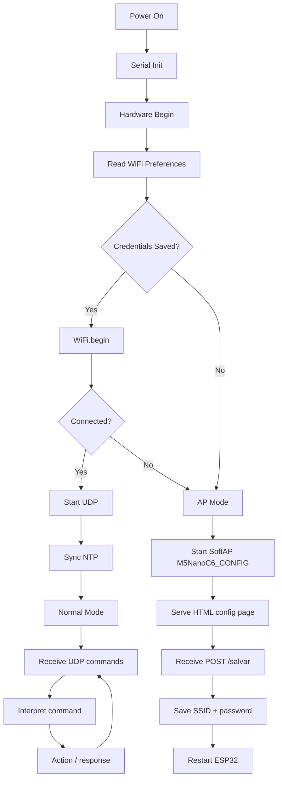
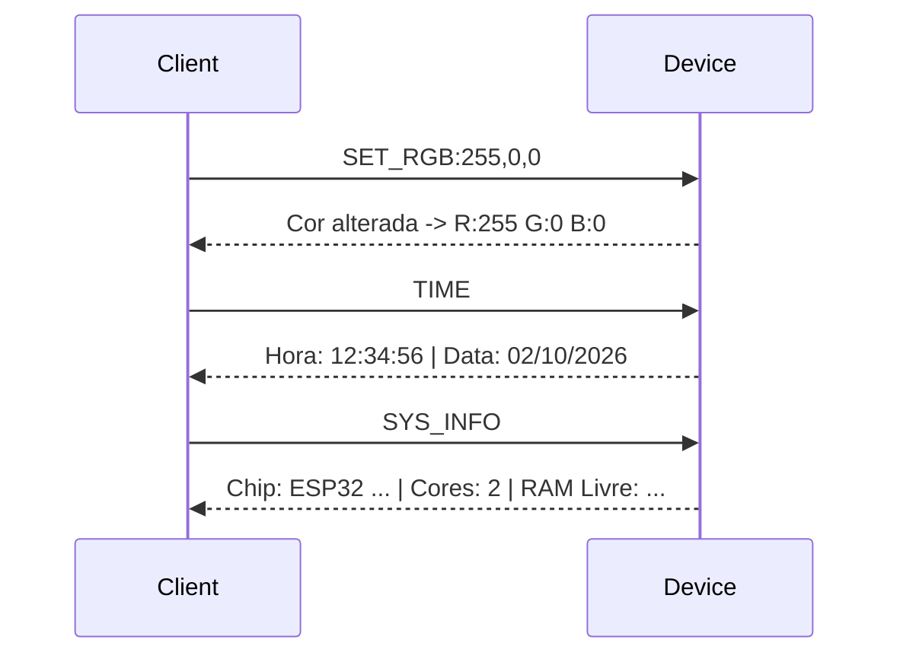
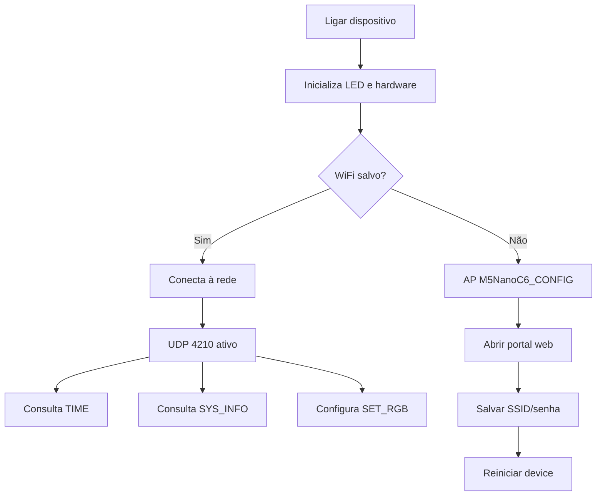

# M5NanoC6 WiFi

A compact, resilient ESP32 Wi‑Fi utility for the M5NanoC6 board. The firmware automatically connects to a saved Wi‑Fi network, falls back to a captive setup portal when needed, exposes a lightweight UDP control interface, and manages status LED feedback, time synchronization, reset behavior, and simple hardware controls.

This project is intentionally small, modular, and easy to adapt for IoT edge devices, local automation, monitoring nodes, and prototype controllers.

---

## Overview

The project is now organized into separate modular C++ headers instead of a single monolithic sketch:

- `M5NanoC6_wifi.ino` — main program, boot flow, and loop
- `Config.h` — hardware pins, UDP port, timezone defaults, and captive portal HTML
- `HardwareController.h` — RGB LED, button handling, IR pulse, blink logic
- `DeviceNetwork.h` — Wi‑Fi connection, AP portal, UDP socket, preferences, factory reset
- `NTPService.h` — timezone configuration and local time retrieval
- `CommandHandler.h` — UDP command parsing and command responses

The runtime flow is:

1. boot the board,
2. read stored Wi‑Fi credentials from NVS/Preferences,
3. connect to Wi‑Fi if credentials exist,
4. otherwise start the access point and web configuration portal,
5. listen for UDP control commands on port `4210`,
6. respond with status, telemetry, or state changes.

---

## Features

- Automatic Wi‑Fi connection with persistent SSID/password storage
- Captive configuration portal (`M5NanoC6_CONFIG`)
- UDP command server on port `4210`
- Local time configuration with NTP and timezone support
- RGB status LED feedback for connection states and configuration sessions
- User reset button support to clear saved Wi‑Fi settings
- Infrared pulse output support using GPIO 3
- Diagnostics commands for system, network, and runtime data
- Direct control of the onboard RGB LED and blue status LED

---

## Hardware and Pin Map

| Signal | Pin | Purpose |
| --- | --- | --- |
| RGB Data | GPIO 20 | NeoPixel data line |
| RGB Enable | GPIO 19 | Enables the NeoPixel power rail |
| Status LED | GPIO 7 | Blue status LED |
| User Button | GPIO 9 | Resets Wi‑Fi config when pressed |
| IR TX | GPIO 3 | Infrared emitter output |

The project uses the M5NanoC6 board with an ESP32-class MCU and an RGB indicator.

---

## Boot and Connection Flow



---

## Web Configuration Portal

When no saved Wi‑Fi settings are available, the board starts an access point named:

```text
M5NanoC6_CONFIG
```

The access point exposes an HTML form on `/` and saves the submitted values when posting to `/salvar`.

Form fields:

- `ssid`
- `senha`

On save, the device stores the values in Preferences and restarts so it can reconnect automatically.

---

## Repository Structure

```text
M5NanoC6_wifi/
├── M5NanoC6_wifi.ino
├── Config.h
├── HardwareController.h
├── DeviceNetwork.h
├── NTPService.h
├── CommandHandler.h
├── README.md
└── platformio.ini (optional, if added by the user locally)
```

---

## File-by-File Description

### `M5NanoC6_wifi.ino`

Main sketch file. Initializes all modules and implements the main logic loop.

Responsibilities:

- startup serial and hardware initialization,
- connect to Wi‑Fi or enter AP mode,
- initialize UDP on successful connection,
- start NTP synchronization,
- process incoming UDP commands,
- handle reset button events.

### `Config.h`

Central configuration file.

Contains:

- board GPIO assignments,
- UDP port definition (`4210`),
- default timezone setting (`-3` for Brasília),
- captive portal HTML page content.

### `HardwareController.h`

Handles hardware-level actions such as:

- RGB LED state changes,
- blink patterns,
- button press detection,
- IR emitter pulse generation,
- low-level board initialization.

### `DeviceNetwork.h`

Handles the networking layer.

Includes:

- Wi‑Fi connection and reconnection logic,
- AP startup for config portal,
- web routes `/` and `/salvar`,
- UDP send/receive handling,
- preferences access for SSID/password, timezone, DST flags,
- factory reset routine.

### `NTPService.h`

Time management service.

Features:

- `configTzTime(...)` configuration,
- timezone/DST handling,
- local time retrieval through `getLocalTime()`,
- helper methods to return formatted time and date strings.

### `CommandHandler.h`

UDP command processor.

This is the command dispatcher for the embedded protocol and implements the supported commands described below.

---

## Command Reference

The device listens on UDP port `4210` and accepts plain text commands from remote clients.

| Command | Description |
| --- | --- |
| `RESET_WIFI` | Clears saved Wi‑Fi credentials and restarts the board |
| `TIME` | Returns current local time and date |
| `DST_ON` | Enables DST/timezone daylight-saving mode |
| `DST_OFF` | Disables DST/timezone daylight-saving mode |
| `SET_FUSO:<value>` | Saves a new timezone offset value |
| `SET_RGB:R,G,B` | Sets the RGB LED color (values 0–255) |
| `LED_ON` | Turns the status LED on (white) |
| `LED_OFF` | Turns the status LED off |
| `IR_TX` | Emits an infrared pulse |
| `SYS_INFO` | Returns chip info and free RAM |

Examples:

```text
SET_FUSO:-3
SET_RGB:255,0,0
SET_RGB:0,255,0
LED_ON
LED_OFF
TIME
RESET_WIFI
SYS_INFO
```

### Example UDP Workflow



---

## Operational States

The board provides visual feedback using the RGB LED:

- white = startup / initialization
- yellow = Wi‑Fi connection attempt
- red = Wi‑Fi failure / error state
- blue = AP configuration portal active
- green = Wi‑Fi connected and UDP ready
- magenta = NTP synchronized

---

## Time and Timezone Configuration

The project uses:

- NTP servers: `a.st1.ntp.br`, `pool.ntp.org`, `time.nist.gov`
- default timezone offset: `-3` (Brasília)
- optional `DST_ON` and `DST_OFF` switching

This allows the device to report local time once it is online.

---

## Reset and Recovery Logic

The reset button is checked in the main loop. If pressed, the device clears saved settings and restarts:

```cpp
if (hardware.botaoPressionado()) {
    network.resetarFabrica();
}
```

This is useful when the device has stale Wi‑Fi configuration, cannot reach the saved network, or needs to be reconfigured.

---

## Build and Flash Requirements

### Required software

- Arduino IDE or VS Code + PlatformIO
- ESP32 board support package
- `WiFi` library (ESP32 core)
- `WebServer` library (ESP32 core)
- `Preferences` library (ESP32 core)
- `Adafruit NeoPixel` library

### Flash steps

1. Open the project in Arduino IDE or PlatformIO.
2. Select the correct ESP32 board target for the M5NanoC6.
3. Connect the board over USB.
4. Compile the project.
5. Upload the sketch.
6. Open the serial monitor at `115200` baud.
7. If Wi‑Fi is not configured, connect to `M5NanoC6_CONFIG` and configure the network.

---

## Troubleshooting

### Wi‑Fi never connects

Check:

- saved SSID/password are valid,
- the router is within range,
- the password is not wrong,
- the stored Preferences namespace is not corrupted.

Use the reset button or `RESET_WIFI` command to clear the stored configuration.

### AP is not showing

Verify:

- the board booted successfully,
- the configuration flow was reached,
- the serial output shows the expected startup logs.

### UDP commands don’t respond

Check:

- the device is connected to Wi‑Fi,
- the client sends to port `4210`,
- the board is not stuck in configuration mode,
- the remote packet IP/port are valid.

### Time is unavailable

Ensure:

- the board has internet access,
- the NTP server is reachable,
- no firewall blocks outbound NTP access.

---

## Practical Example



---

## Summary

This repository is a practical ESP32 Wi‑Fi control and monitoring firmware for the M5NanoC6. It combines:

- Wi‑Fi auto-connect and portal configuration,
- persistent saved network settings,
- UDP-based command protocol,
- NTP time synchronization,
- LED and GPIO control,
- diagnostics and hardware feedback,
- simple, modular C++ file organization.

It is well suited for prototypes, local automation, monitoring, and lightweight networked embedded devices.

---

## Notes

The project is intentionally minimal and direct. It focuses on deterministic behavior, low complexity, and practical embedded control rather than large framework abstractions.

If you want, I can also generate a stronger GitHub badge section, a `platformio.ini` file, a `LICENSE`, or a more visual ASCII-art based README version.
