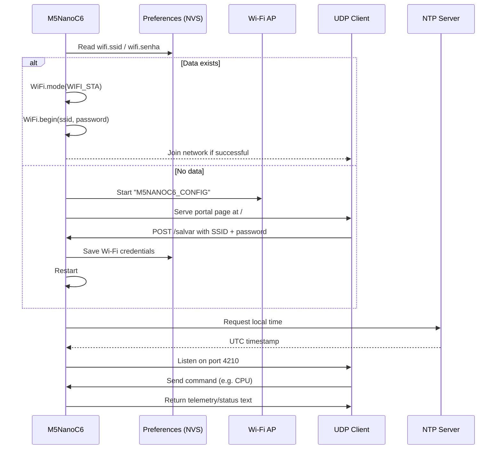

# M5NanoC6 WiFi

A compact and resilient Wi-Fi utility firmware for the M5NanoC6 hardware. This project turns the device into a lightweight ESP32-based network node that can:

- connect to a saved Wi-Fi network automatically,
- start a captive configuration portal when no credentials are available,
- expose a UDP command interface for remote control and telemetry,
- report system metrics and current time,
- manage status LEDs and device reset behavior.

The sketch is intentionally small, portable, and easy to adapt for automation, monitoring, and IoT edge devices.

---

## Overview

This repository contains a single Arduino/ESP32 sketch split into logical source files:

- `M5NanoC6_wifi.ino` — main setup, loop, and web configuration page
- `wifi.ino` — Wi-Fi connection, portal logic, and configuration persistence
- `commands.ino` — UDP command dispatcher and device control commands
- `utils.ino` — NTP synchronization and helper utilities

The firmware is designed around a simple operation model:

1. boot the board,
2. try to connect to saved Wi-Fi credentials,
3. if not available, open an access point and serve a configuration form,
4. accept UDP commands from a remote host,
5. provide diagnostics, LEDs, network info, and clock synchronization.

---

## System Architecture

```mermaid
flowchart TD
    A[Power On] --> B[Initialize GPIO / RGB LED / Serial]
    B --> C[Boot Animation]
    C --> D{Credentials saved in Preferences?}
    D -- Yes --> E[WiFi.begin(ssid, password)]
    D -- No --> F[Start Access Point: M5NANOC6_CONFIG]
    F --> G[Serve HTML configuration page]
    G --> H[POST /salvar]
    H --> I[Store SSID and password in NVS / Preferences]
    I --> J[Restart ESP32]
    E --> K{Connected?}
    K -- Yes --> L[Enable UDP socket on port 4210]
    L --> M[Sync time via NTP]
    M --> N[Normal runtime]
    K -- No --> F
    N --> O[Receive UDP packets]
    O --> P[Parse command]
    P --> Q[Execute action: LED, status, time, diagnostics, reset]
    Q --> R[Reply to client over UDP]
```

### High-level block view

```text
+-----------------------------------------------------------+
|                     M5NanoC6 Device                       |
|                                                           |
|  +-------------------+   +------------------------------+ |
|  | ESP32 Core        |   | Wi-Fi / Web Server           | |
|  | - boot            |   | - STA client mode            | |
|  | - GPIO control    |   | - AP config portal           | |
|  | - UDP parser      |   | - Preferences/NVS           | |
|  +-------------------+   +------------------------------+ |
|                             |                             |
|  +-------------------+       |       +-------------------+ |
|  | RGB Indicator     |       |       | Reset Button      | |
|  | (NeoPixel)        |       |       | + GPIO 9          | |
|  +-------------------+       |       +-------------------+ |
|                             |                             |
|  +-------------------+       +------------------------------+ |
|  | UDP Commands      |         Status LED / GPIO 7          |
|  | - LED_ON          |                                      |
|  | - TEMP            |                                      |
|  | - NET_INFO        |                                      |
|  | - TIME            |                                      |
|  | - RESET_WIFI      |                                      |
|  +-------------------+                                      |
+-----------------------------------------------------------+
```

---

## Hardware and Pin Map

The project is built around an M5NanoC6 board with an ESP32-compatible MCU and a single RGB LED.

| Signal | Pin | Purpose |
| --- | --- | --- |
| RGB Data | GPIO 20 | NeoPixel status indicator |
| ENABLE | GPIO 19 | Device enable / power rail control |
| Status LED | GPIO 7 | General-purpose LED output |
| Reset Button | GPIO 9 | Press to clear saved Wi-Fi configuration |

### Typical runtime behavior

```text
BOOT
  │
  ├─ RGB boot animation
  ├─ Serial console initialized at 115200 baud
  ├─ Try Wi-Fi connection with stored credentials
  │
  ├─ If success:
  │     ├─ turn status green
  │     ├─ initialize UDP port 4210
  │     └─ synchronize clock with NTP
  │
  └─ If failed:
        ├─ turn status blue
        ├─ host Wi-Fi AP named M5NANOC6_CONFIG
        └─ serve HTML config portal on port 80
```

---

## Features

### 1. Automatic Wi-Fi connection

The device reads previously saved SSID/password values from the ESP32 NVS storage using `Preferences`.

- stored under namespace: `wifi`
- keys used:
  - `ssid`
  - `senha`

If no saved SSID is present, the board automatically enters AP mode and waits for a new configuration.

### 2. Captive configuration portal

When Wi-Fi is not configured, the firmware starts a soft access point:

```text
SSID: M5NANOC6_CONFIG
AP IP: default ESP softAP IP assigned by the stack
```

The web server serves a basic HTML page on `/` and accepts form submissions on `/salvar`.

The form captures:

- `ssid`
- `senha`

After saving credentials, the device reboots to reconnect using the new configuration.

### 3. UDP command protocol

The project listens on UDP port `4210` and parses incoming text commands. The command handlers live in `commands.ino` and respond back to the remote sender using the same UDP socket.

### 4. LED control and visual feedback

The board includes a programmable RGB LED and a digital status LED:

- green = connected to Wi-Fi
- blue = access point configuration mode
- orange = connection attempt in progress
- red = configuration missing / failure path

The firmware also supports blinking patterns and controlled LED state changes:

- `LED_ON`
- `LED_OFF`
- `LED_PISCA:<count>:<delay>`
- `LED_BLINK:<interval_ms>`

### 5. Diagnostics and monitoring

The firmware can answer with detailed runtime information, including:

- CPU temperature
- chip model, revision, cores, and clock speed
- free heap / lowest heap / largest allocatable block
- flash size and sketch usage
- NTP time / local date-time
- Wi-Fi interface information (IP, gateway, mask, RSSI, SSID)
- last boot cause
- uptime in milliseconds

### 6. Time synchronization

NTP is configured using:

- `pool.ntp.org`
- UTC-3 offset (`-3 * 3600`) for Brasília time
- no daylight saving offset

This allows the device to report local time accurately once it is online.

---

## File-by-File Description

### `M5NanoC6_wifi.ino`

This is the main sketch file. It contains the central execution flow and acts as the coordinator for the system.

Responsibilities:

- includes the required libraries:
  - `WiFi.h`
  - `WiFiUdp.h`
  - `WebServer.h`
  - `Preferences.h`
  - `Adafruit_NeoPixel.h`
  - `Zigbee.h`
- defines board pins and constants
- initializes the LED object and storage objects
- builds the HTML configuration page in `PROGMEM`
- runs `setup()` and `loop()`
- handles Wi-Fi state transitions
- listens for UDP commands and forwards them to `executa_comando()`
- checks the reset button and triggers a configuration wipe if pressed

### `wifi.ino`

This file handles the network layer.

Primary functions:

- `iniciarPortal()`
  - set board to AP mode
  - generate device access point
  - register web routes `/` and `/salvar`
  - begin the HTTP server

- `conectarWifi()`
  - load SSID/password from non-volatile memory
  - attempt Wi-Fi connection
  - retry for a limited number of cycles
  - return success/failure

- `salvarWifi()`
  - read submitted SSID/password from the HTTP POST request
  - save them in persistent memory
  - restart the device

- `zerarConfiguracoes()`
  - clear stored Wi-Fi values
  - send a UDP notification message
  - blink the onboard LED several times
  - restart the board

### `commands.ino`

This is the command interpreter for the remote protocol.

The command parser checks the string value received in the UDP packet and executes the appropriate action.

Example commands handled:

- `RESET_WIFI`
- `LED_ON`
- `LED_OFF`
- `TEMP`
- `CPU`
- `RAM`
- `FLASH`
- `INIT`
- `UPTIME`
- `MAC`
- `NET_INFO`
- `TIME`
- `LED_PISCA:<count>:<delay>`
- `LED_BLINK:<ms>`

The parser also sends acknowledgment text back to the sender with a status or result.

### `utils.ino`

This file supplies the time and status helper functions.

Functions:

- `configureNTP()`
  - call `configTime()` with timezone data
  - wait for valid local time
  - print the current timestamp to serial

- `rainbowBoot()`
  - produce a short LED color sequence during startup

- `setStatusRGB()`
  - set the color and brightness of the RGB LED

- `GetDataHora()`
  - fetch local time from the system clock
  - format as `DD/MM/YYYY - HH:MM:SS`
  - return it via UDP

---

## Command Reference

The device responds to UDP commands sent to port `4210`.

| Command | Description |
| --- | --- |
| `RESET_WIFI` | clears stored Wi-Fi settings and restarts the board |
| `LED_ON` | turns the status LED on |
| `LED_OFF` | turns the status LED off |
| `TEMP` | returns CPU temperature |
| `CPU` | returns chip model, revision, cores, frequency, and heap info |
| `RAM` | returns heap memory status |
| `FLASH` | returns flash size and sketch usage details |
| `INIT` | returns the reset reason |
| `UPTIME` | returns the system uptime in milliseconds |
| `MAC` | returns the Wi-Fi MAC address |
| `NET_INFO` | returns IP, gateway, subnet mask, SSID, and RSSI |
| `TIME` | returns the current time in local date/time format |
| `LED_PISCA:<count>:<delay>` | blinks the LED a given number of times with a delay |
| `LED_BLINK:<ms>` | toggles automatic blinking with the provided interval |

### Example UDP command flow

```text
Client --> UDP packet: LED_ON
Device --> UDP packet: LED ligado

Client --> UDP packet: NET_INFO
Device --> UDP packet:
IP: 192.168.1.25
Gateway: 192.168.1.1
Mascara de rede: 255.255.255.0
RSSI: -52 dbm
Nome da Rede: MinhaRede
```

---

## Runtime Flow



---

## Boot and Reset Logic

### Normal boot sequence

```text
1. board power on
2. GPIO pins initialized
3. LED boot colors are displayed
4. firmware tries saved Wi-Fi credentials
5. on success: connect to Wi-Fi and start UDP service
6. on failure: AP mode + configuration portal
7. device waits for commands or reconfiguration
```

### Reset button logic

The project checks the reset button in the main loop:

```cpp
if (digitalRead(BOTAO_RESET) == LOW) {
  delay(50);
  if (digitalRead(BOTAO_RESET) == LOW) {
    zerarConfiguracoes();
  }
}
```

This is intended as an emergency action to clear stored Wi-Fi credentials and restart the board.

---

## Configuration Portal

When no valid Wi-Fi configuration is found, the board creates an access point and exposes a small form page.

### HTML form behavior

The page contains:

- title: `Configuração WiFi - M5NanoC6`
- fields:
  - `ssid`
  - `senha`
- submit button: `Salvar`

The form submits to `/salvar` using `POST`, where the firmware stores the values in the ESP32 non-volatile preferences and reboots.

### Screenshot concept

```text
+-------------------------------------+
| Configuração WiFi - M5NanoC6        |
|                                     |
| SSID: [____________________]         |
| Password: [_________________]       |
|                                     |
|            [ Save ]                  |
+-------------------------------------+
```

---

## Deployment Notes

This project is especially useful for:

- sensor gateways,
- ESP32-based automation controllers,
- remote status monitoring devices,
- local device control using lightweight UDP messaging,
- quick prototypes that require configuration via a web form and diagnostics via network commands.

Because it uses the ESP32 `Preferences` API, settings persist across reboots without a separate storage device.

---

## Build and Flash Requirements

### Required software

- Arduino IDE or VS Code + PlatformIO
- ESP32 board support package
- libraries:
  - `WiFi` (ESP32 core)
  - `WebServer` (ESP32 core)
  - `Preferences` (ESP32 core)
  - `Adafruit NeoPixel`

### Flashing steps

1. Open the project in Arduino IDE or PlatformIO.
2. Select the correct ESP32 board variant.
3. Ensure the board is connected via USB/serial.
4. Compile the code.
5. Upload the sketch.
6. Watch the serial monitor at `115200` baud.
7. If configuration is missing, connect to the AP and submit SSID/password.

---

## Troubleshooting

### The device never connects to Wi-Fi

Check:

- the SSID/password are correctly stored,
- the AP is within range,
- the board is not blocked by a bad password,
- the `wifi` namespace in NVS is not stale or corrupted.

Use the `RESET_WIFI` command or hold the physical reset button to wipe settings.

### The AP is not appearing

Verify:

- the board booted successfully,
- `iniciarPortal()` was reached,
- the serial monitor shows the expected startup messages.

### UDP commands are not responding

Check:

- the board is connected to Wi-Fi,
- the client sends to the correct port (`4210`),
- the sender IP is valid and reachable,
- the board is not stuck in AP mode or setup mode.

### Time is not available

Ensure:

- the device is connected to the internet,
- NTP can reach `pool.ntp.org`,
- no firewall or local network restrictions block outbound UDP/TCP access.

---

## Practical Example

```text
Power on device
  -> RGB boot animation runs
  -> if saved Wi-Fi exists, connect automatically
  -> if not, AP M5NANOC6_CONFIG is visible

Open browser at the access point IP
  -> fill SSID and password
  -> submit the form

Device restarts and joins the network
  -> NTP sync begins
  -> UDP port 4210 is active
  -> remote client can query CPU, IP, memory, or time
```

---

## Summary

This repository is a small but effective ESP32-based Wi-Fi control and monitoring firmware for the M5NanoC6. It combines:

- Wi-Fi auto-connect,
- self-healing setup portal,
- persistent network settings,
- diagnostic commands,
- time synchronization,
- LED state control,
- a compact UDP control protocol.

It is well suited for embedded prototypes, local automation, and lightweight network-connected device workflows.

---

## Notes

The repository is intentionally minimal and direct. It is not a large framework or SDK-based project; it focuses on practical embedded control, low-memory operation, and simple deterministic behavior for an ESP32 board.

If you want, I can also generate:

1. a more polished README with extra SVG-style architecture diagrams,
2. a banner image section for GitHub,
3. a `LICENSE` file,
4. a `platformio.ini` configuration for easier building and upload.
